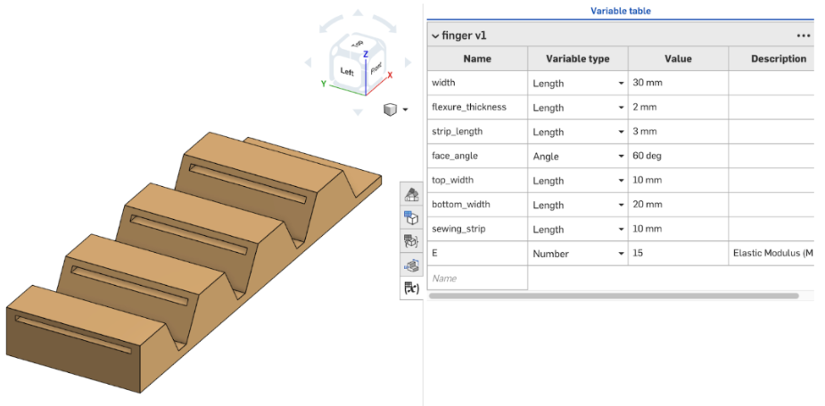
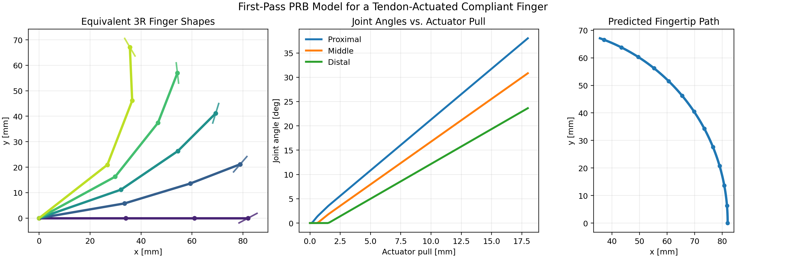
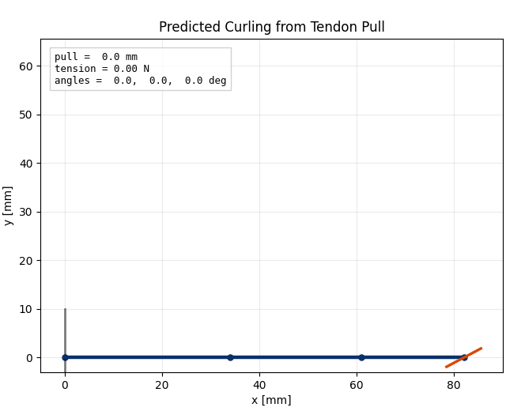

# Compliant Tendon-Actuated Gripper

Compliant Tendon-Actuated Gripper is a mechanical robotics project centered on a monolithic TPU finger that curls through flexure joints when a tendon is pulled along its palmar side. The goal is not just to print a soft mechanism that moves, but to build one whose motion can be predicted from geometry and actuator input with a pseudo-rigid-body (PRB) model.

<div style="display: flex; justify-content: center; gap: 20px;">
  
  
</div>

---

For now, I am trying to keep the repo compact. It will grow more as I do more testing:

- `README.md` carries the project story and the first-pass math (will def change)
- `scripts/prb.py` generates the baseline PRB analysis plot
- `scripts/animation.py` generates the curling animation
- `imgs/` stores the media used directly in this page

## Current Hardware

The current mechanism direction is a single-piece compliant finger with three flexure regions, routed tendon guides, and a distal anchor. Pulling the strip shortens the tendon path, rotates the equivalent pseudo-joints, and curls the fingertip inward for a later planar pinch-gripper configuration.


## Design Variables

The first design pass is focused on the geometry changes most likely to affect closing behavior.

| Parameter | Baseline | What changes physically | Expected effect on motion |
| --- | ---: | --- | --- |
| Flexure thickness `t_f` | 3 mm | Changes the bending stiffness of each compliant joint | Thicker flexures increase joint stiffness and resist curl; thinner flexures should bend earlier and more easily |
| Tendon strip length `L_strip` | 120 mm (assuming for now)| Changes the effective compliance of the tendon path | Longer strip length lowers axial stiffness, so more actuator pull is absorbed in stretch before joint rotation |
| Face angle `theta_face` | 28 deg (messing with multiple values) | Changes the distal contact orientation of the finger | Alters how the fingertip approaches an object and the posture at full closure |

## Modeling Approach

The physical finger is compliant, but the first-pass model treats it as a planar 3R chain:

`compliant flexures -> torsional pseudo-joints -> equivalent rigid links`

That abstraction is useful because it keeps the mechanism close to the printed hardware while still allowing straightforward kinematic analysis. In the code, each flexure becomes a torsional spring, each rigid segment becomes a link, and the tendon pull acts through joint moment arms at the pseudo-joints.

## First-Pass Math

### Definitions

- `L1, L2, L3`: equivalent rigid link lengths
- `theta1, theta2, theta3`: pseudo-joint rotations measured from the straight finger configuration
- `r1, r2, r3`: tendon moment arms at the flexures
- `s`: actuator pull, measured as tendon shortening in millimeters
- `T`: tendon tension
- `k1, k2, k3`: effective torsional stiffness values for the flexures
- `tau_{0,1}`, `tau_{0,2}`, `tau_{0,3}`: activation torques that delay more distal joints in the first-pass actuation model

### Flexure Stiffness


Each compliant joint is approximated with a beam-based torsional stiffness (I cannot take credit for this pretty LaTeX, shoutout AI for making this equation look pretty):

$$
k_i = \frac{E_{TPU} \, b_i \, t_f^3}{12 \, l_{f,i}}
$$


where `E_TPU` is the effective TPU modulus, `b_i` is flexure width, `t_f` is flexure thickness, and `l_f,i` is flexure length. The cubic dependence on `t_f` is why thickness is one of the most important design knobs in this repo.

### Joint Angles from Tendon Tension

The actuation model used in `scripts/prb.py` is a low-order static balance. Each joint only starts rotating after the tendon torque exceeds an activation threshold:

$$
\theta_i(T) =
\mathrm{clip}\left(
\frac{T r_i - \tau_{0,i}}{k_i},
0,
\theta_{i,\max}
\right)
$$

This gives a simple way to represent sequential curling without claiming a full finite element model. Lower proximal thresholds and higher distal thresholds make the first joint engage before the others as pull increases.

### Tendon-Length Constraint

The actuator pull is split between tendon stretch and tendon shortening caused by joint rotation, which can be modeled pretty simply:

$$
s(T) = \frac{T}{k_t} + \sum_{i=1}^{3} r_i \, \theta_i(T)
$$

where `k_t` is the effective axial stiffness of the tendon strip. In the script, the model solves this scalar equation for `T`, then maps the resulting tension to joint angles and fingertip position.

### Forward Kinematics

Once `theta1`, `theta2`, and `theta3` are known, the fingertip location follows from the standard 3R planar chain:

$$
x = L_1 \cos(\theta_1) + L_2 \cos(\theta_1 + \theta_2) + L_3 \cos(\theta_1 + \theta_2 + \theta_3)
$$

$$
y = L_1 \sin(\theta_1) + L_2 \sin(\theta_1 + \theta_2) + L_3 \sin(\theta_1 + \theta_2 + \theta_3)
$$

The distal contact face is tracked with

$$
\phi_{face} = \theta_1 + \theta_2 + \theta_3 + \theta_{face}
$$

so the face-angle parameter changes the final contact pose even when the rest of the actuation model stays fixed.

### What the Parameters Do

- Increasing `t_f` raises `k_i` roughly with `t_f^3`, so the finger needs more tendon tension to reach the same curl.
- Increasing `L_strip` lowers `k_t`, so more input displacement is lost to tendon stretch before the joints rotate.
- Increasing `theta_face` rotates the distal contact orientation, changing the closing posture and how the fingertip meets an object.

## Simulation Preview

The first-pass scripts are intended to back the math above with runnable outputs instead of static equations.

### Baseline Analysis Plot



The generated figure overlays representative finger shapes, joint-angle growth versus actuator pull, and the predicted fingertip path.

### Curling Animation



The animation uses the same model as the plot and shows how the finger shape evolves as actuator pull increases. Force is not as important for my use case, as my motors are position-controlled, but it is still interesting to see how the model predicts tension growth as the finger curls since we have that beam bending stiffness in the mix...

## Run the Model

With `just`:

```bash
just setup
just prb
just animate
```

`just all` will regenerate both outputs.

If anyone wants to replicate this, if your system Python does not already have the plotting dependencies, do a one-time local setup:

```bash
python3 -m venv .venv
.venv/bin/python -m pip install -r requirements.txt
```

After that, the scripts can still be run from the repository root with plain `python3`:

```bash
python3 scripts/prb.py
python3 scripts/animation.py
```

Both commands write their outputs into `imgs/`. If a local `.venv` exists, the scripts automatically use it.

## Next Steps

- Add the real CAD render and prototype image using the stable filenames listed above
- Tune the baseline parameters against measured joint angles from the printed hardware
- Expand the tendon model beyond activation thresholds once prototype data is available
- Compare tracked fingertip trajectories against the PRB predictions
